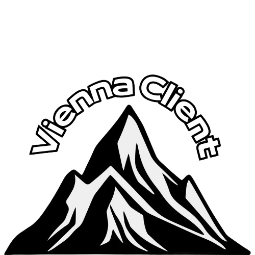

    

    
    

# 💬 Vienna Client
Vienna Client is an Open Source project made for people that are approaching the world of modding. This app will help the alot. It's a basic Android flasher with everything you need! It supports FASTBOOT AND ADB from Platform-Tools from the Android SDK page.

# 📌 Information
- Written in C# (.NET Framework 4.7.2)
- STILL IN BETA! If you report find any bugs, please open an Issue on this GitHub Page.

# 📌 Features
- Fastboot Flasher ✅
- ADB NOT IMPLEMENTED YET (coming soon...) ❎
- Minimalistic Graphics ✅
